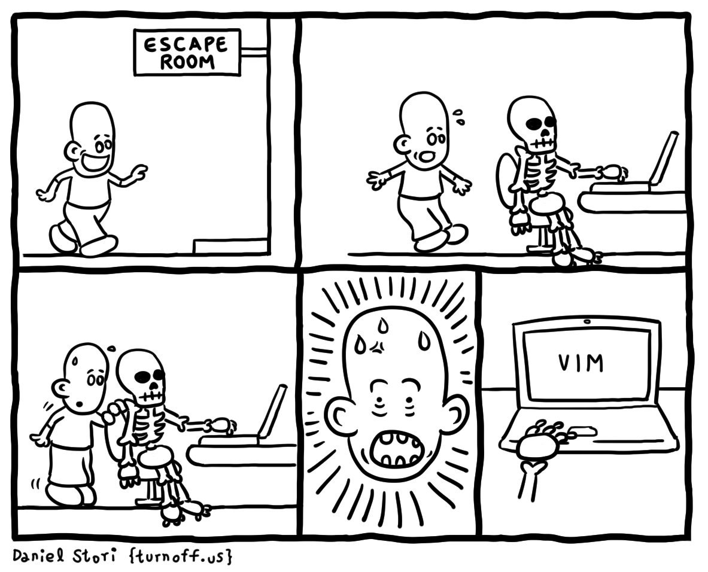

# Backstory

I guess my first encounter with vim was like most others: coincidental and unwanted! _I just want my nano back_!
 
I was still new to linux and my most trusted `Ctrl+c` shortcut was ineffective...
So I did, what every noob (and veteran) would do: google the problem and click on the first stackoverflow entry [<How do I exit Vim?>](https://stackoverflow.com/questions/11828270/how-do-i-exit-vim). And with this, the problem got solved... for now.

With time I stopped looking up stackoverflow and got more confident at exiting vim, even so to laugh at other people watching them struggle with this hell.
But by googling "vim" so many times, youtube also cought wind of it and started recommending me videos, so it piqued my interest!
I guess the final drop was a friend of mine (shoutout [@tngebauer](https://github.com/tngebauer)), who was so enthusiastic about coding in the terminal, vim keybindings are so good, try out [this game](https://vim-adventures.com/), you will code like never before, ... The list goes on and I guess everyone has someone like that in their circle (if not, maybe look in a mirror :P).

Considering that I am currently writing an article that cointains the word "vim" (somehow) inside, it seems my friend succeeded, but I have had no idea in what rabbit hole I have been thrown in.

## Nix + Vim = ❤️ (❓)

After having some problems with fedora and python (I guess I will make a post just about my NixOS transition at some point), I started trying to like nix and NixOS.
At some point I wanted to move my vim config, which at that time consistent of [NvChad](https://nvchad.com/) with some minor tweeks on my side, thanks to the [video](https://www.youtube.com/watch?v=Mtgo-nP_r8Y) from [Dreams of Code](https://www.youtube.com/@dreamsofcode) (highly recommend it).
I had no idea about configuring vim, and even less about nix at that time, so the combination was a tough pill to swallow.
At the beginning I just had my normal nvim config sitting under `~/.config/nvim` and this worked fine, but somehow it didn't feel nixy.
After some googling around, I came upon [the solution (and problem)](https://www.youtube.com/watch?v=SXyrYMxa-VI) of all my problems: [NixVim](https://github.com/nix-community/nixvim)!

> NixVim is a Neovim distribution built around Nix modules. It is distributed as a Nix flake, and configured through Nix, all while leaving room for your plugins and your vimrc.

This looked like the solution to al my problems and how I am going to configure my vim setup using the nix way. The only problem left is.. I don't know anything about vim, except copy-pasting code snippets and adding them to [lazyvim](https://www.lazyvim.org/).
Oh boy was I in for a treat!

## Storyline

While the story so far sounds like I was having a rough time, you are completely right! But nevertheless, it was fun and I enjoyed to configure everything and learn a bit more about lua, (neo)vim and the plugin ecosystem surrounding it. This is the introduction to a series of mine, on how I setup NixVim on my system and how I am using it.
Even tho I am soon rocking NixOS for one year, I have so much to learn. Especially about flakes, since they seem to be a central part around Nix(OS). But I would like this series to be an entry point for beginners, like I am, so they can start from somewhere without being overwhelmed by the sheer complexity of nix.
I will show you how I installed NixVim under home-manager and how I configured some plugins by looking at popular Neovim setups and some published NixVim setups.

See you in the next one! :)
